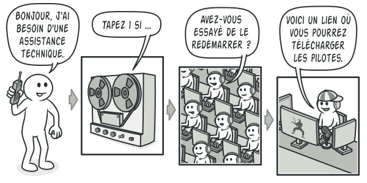

Les patterns de comportement distribuent les algorithmes / les traitements entre les objets.  
Il organisent les interactions en renseignant le flux de controle et de traitement au sein d'un systeme d'objets.  
La distribution se fait par héritage ou par délégation.

# 1) Chain of responsability

  
**But**  
Construire une chaine d'objets :

- si un objet de la chaine ne peut pas répondre à une requete, il peut la passer à un *successeur*
- ainsi de suite jusqu'à ce que l'un des objets puisse répondre à la requete

*voir exemple d'implémentation dans ChainOfResponsibility*

# 2) Command

Ce pattern transforme une requete en objet afin de faciliter les opération relatives à la requete.  

*voir exemple d'implémentation dans Command*

# 3) Iterator

Iterator est un patron qui permet de parcourir les élements d'une collection sans réveler sa représentation interne (liste, pile, arbre...)  

  

  

*voir exemple d'implémentation dans Iterator*

# 4) Mediator

Mediator est un patron de conception comportemental qui diminue les dépendances chaotiques entre les objets.  
Il restreint les communications directes entre les objets et les force à collaborer uniquement via un objet médiateur.  

  

  

*voir exemple d'implémentation dans Mediator*

